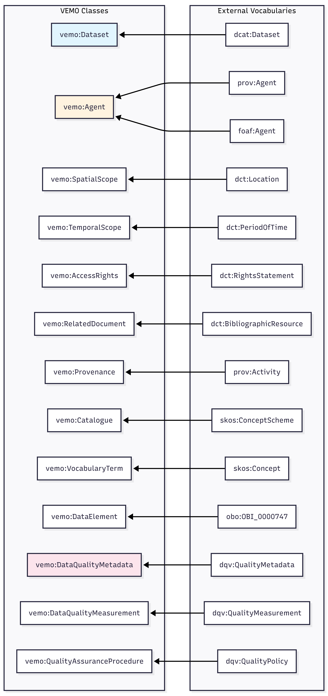
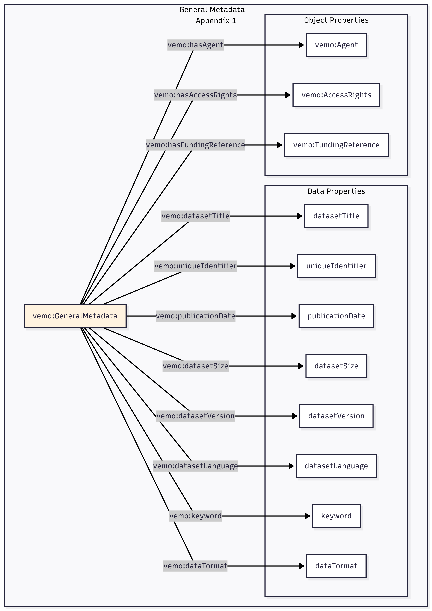
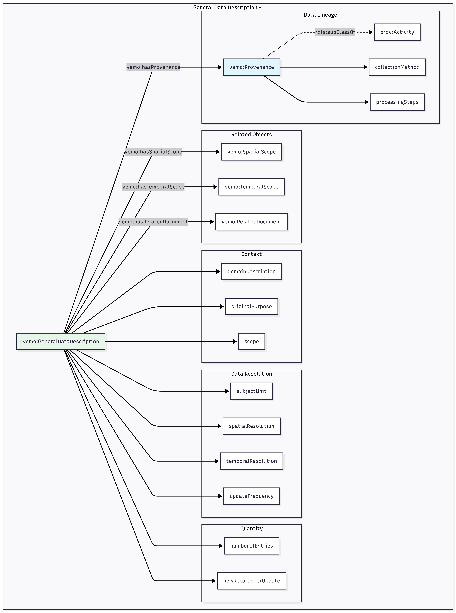
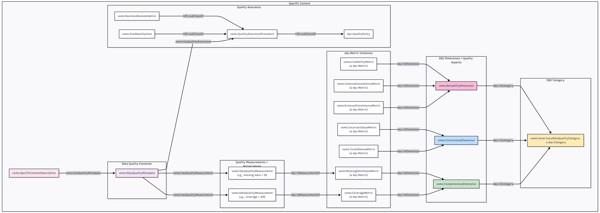

# VEMO - Veterinary Epidemiology Metadata Ontology

## Overview

VEMO is a metadata ontology for describing veterinary epidemiological datasets. It provides a structured, machine-readable framework for documenting dataset metadata to enhance data reusability and fitness-for-purpose assessment.

**Namespace:** `https://w3id.org/vemo/0.2#`
**Prefix:** `vemo:`

---

## High-Level Ontology Architecture

VEMO follows the structure of the metadata guidelines and consists of three main parts:

| Section                                | Description                                      | Related To |
| -------------------------------------- | ------------------------------------------------ | ---------- |
| **General Metadata**             | Basic information: title, creators, format, etc. | Appendix 1 |
| **General Data Description**     | Context: purpose, spatial/temporal coverage      | Appendix 2 |
| **Specific Content Description** | Details: tables, columns, quality metrics        | Appendix 3 |

The `vemo:hasPart` property connects the Dataset to each of these three sections (see Figure 1).

*Figure 1: High-level of VEMO ontology architecture*

---

## Class Hierarchy with External Alignments

VEMO classes are built on top of existing standards via `rdfs:subClassOf` relationships:

| Standard                                               | Description              | VEMO Usage                                      |
| ------------------------------------------------------ | ------------------------ | ----------------------------------------------- |
| **DCAT** (Data Catalog Vocabulary)               | Describing datasets      | `vemo:Dataset` extends `dcat:Dataset`       |
| **PROV-O** (Provenance Ontology)                 | Tracking data origin     | `vemo:Agent` and `vemo:Provenance`          |
| **Dublin Core Terms**                            | Basic metadata           | Locations and time periods                      |
| **SKOS**                                         | Controlled vocabularies  | Catalogues (SPECIES, SAMPNT) as concept schemes |
| **DQV** (Data Quality Vocabulary)                | Quality metrics          | Data quality integration                        |
| **FOAF**                                         | People and organizations | Agent descriptions                              |
| **OBI** (Ontology for Biomedical Investigations) | Data elements            | Variables/attributes                            |

Figure 2 summarizes the different classes included in VEMO and how they align with existing standards. Complete representation of the Object and Data properties are presented in Figures 3 and Table 1 respectively. The details of these éléments are presented in the following sections.

*Figure 2: Class hierarchy with external alignment of VEMO*

*Figure 3: Complete object properties of VEMO*

## Complete Data Properties

*Table1 Complete data properties of VEMO*

| Property                | Domain                     | Range       | Appendix |
| ----------------------- | -------------------------- | ----------- | -------- |
| datasetTitle            | GeneralMetadata            | xsd:string  | 1        |
| uniqueIdentifier        | GeneralMetadata            | xsd:string  | 1        |
| publicationDate         | GeneralMetadata            | xsd:date    | 1        |
| datasetSize             | GeneralMetadata            | xsd:string  | 1        |
| datasetVersion          | GeneralMetadata            | xsd:string  | 1        |
| datasetLanguage         | GeneralMetadata            | xsd:string  | 1        |
| keyword                 | GeneralMetadata            | xsd:string  | 1        |
| dataFormat              | GeneralMetadata            | xsd:string  | 1        |
| domainDescription       | GeneralDataDescription     | xsd:string  | 2        |
| originalPurpose         | GeneralDataDescription     | xsd:string  | 2        |
| scope                   | GeneralDataDescription     | xsd:string  | 2        |
| subjectUnit             | GeneralDataDescription     | xsd:string  | 2        |
| spatialResolution       | GeneralDataDescription     | xsd:string  | 2        |
| temporalResolution      | GeneralDataDescription     | xsd:string  | 2        |
| updateFrequency         | GeneralDataDescription     | xsd:string  | 2        |
| numberOfEntries         | GeneralDataDescription     | xsd:integer | 2        |
| newRecordsPerUpdate     | GeneralDataDescription     | xsd:string  | 2        |
| collectionMethod        | Provenance                 | xsd:string  | 2        |
| processingSteps         | Provenance                 | xsd:string  | 2        |
| componentName           | DataComponent              | xsd:string  | 3        |
| componentDescription    | DataComponent              | xsd:string  | 3        |
| relationshipDescription | DataComponent              | xsd:string  | 3        |
| attributeName           | DataElement                | xsd:string  | 3        |
| attributeLabel          | DataElement                | xsd:string  | 3        |
| attributeDefinition     | DataElement                | xsd:string  | 3        |
| dataType                | DataElement                | xsd:string  | 3        |
| unit                    | DataElement                | xsd:string  | 3        |
| missingValueCode        | DataElement                | xsd:string  | 3        |
| changeLogEntry          | SpecificContentDescription | xsd:string  | 3        |
| businessRule            | QualityAssuranceProcedure  | xsd:string  | 3        |

---

## Detailled description of VEMO

## Part 1: General Information (Appendix 1)

As shown in Figure 4, the General metadata section captures all the essential identification and administrative details when cataloging any research dataset. It starts with the basics like the dataset's title and unique identifier (typically a DOI), then covers the people involved, who created it, who published it, and who else contributed. It also includes versioning information and publication dates so users know exactly which iteration they're looking at and when it was released. The technical specifications are here too, for examples: what format the data comes in (CSV, JSON, RDF, etc.), what language it's written in, and how large the files are. Keywords help with discoverability, while funding references acknowledge the research grants that made the work possible. Finally, access rights spell out the licensing terms and any restrictions on who can use the data and how.

*Figure 4: Properties of the General Metadata Section of VEMO*

Here we use data properties for simple text or numeric values (like title, size, or version number) and object properties when linking to something more complex—for
instance, an Agent representing a person or organization with their own set of details like name, affiliation, and contact information. The different items of the General Information section and mapping with existing standards are presented in Table 2.

Table 2: Mapping of the properties associated with the General information section

| Metadata Item     | VEMO Property            | Type           | Aligned To           |
| ----------------- | ------------------------ | -------------- | -------------------- |
| Title             | vemo:datasetTitle        | DataProperty   | dct:title            |
| Unique identifier | vemo:uniqueIdentifier    | DataProperty   | dct:identifier       |
| Creators          | vemo:hasAgent            | ObjectProperty | prov:wasAttributedTo |
| Publisher         | vemo:hasAgent            | ObjectProperty | -                    |
| Contributors      | vemo:hasAgent            | ObjectProperty | -                    |
| Access conditions | vemo:hasAccessRights     | ObjectProperty | dct:rights           |
| Publication date  | vemo:publicationDate     | DataProperty   | dct:issued           |
| Funding reference | vemo:hasFundingReference | ObjectProperty | -                    |
| Size              | vemo:datasetSize         | DataProperty   | dct:extent           |
| Version           | vemo:datasetVersion      | DataProperty   | -                    |
| Language          | vemo:datasetLanguage     | DataProperty   | dct:language         |
| Keywords          | vemo:keyword             | DataProperty   | dcat:keyword         |
| Format            | vemo:dataFormat          | DataProperty   | dct:format           |

---

## Part 2: General Data Description (Appendix 2)

This section answers the question: **"What is this data actually about?"** Someone looking at the data needs to understand why it exists, was it collected for
research, for invoicing, for regulatory compliance? For example, a dataset might have been originally created for monitoring broiler health in commercial
farms. They also need to know what's included: the scope might cover only poultry in Poland from 2020-2023, or perhaps cattle across all of Europe. The
resolution matters too; is each row representing a single animal, a farm visit, or an entire region? Are these daily observations or monthly summaries? For
example, a dataset might have farm-level records updated weekly. Finally, The provenance of the data, or data lineage, tells you how data was collected (for
example through veterinary inspections or farmer self-reporting) and what processing steps were applied before you see it.This last item is made of different subcomponents
presented in Figure 5.

The different items of the General Data Description section are presented in Figure 5 and Table  3

*Figure 5: Properties of the General Data Description section of VEMO*

*Table 3: Mapping of the Properties associated with the General Data Description section of VEMO*

| Metadata Item           | VEMO Property            | Type           | Aligned To   |
| ----------------------- | ------------------------ | -------------- | ------------ |
| Domain                  | vemo:domainDescription   | DataProperty   | -            |
| Original purpose        | vemo:originalPurpose     | DataProperty   | -            |
| Scope                   | vemo:scope               | DataProperty   | -            |
| Related documents       | vemo:hasRelatedDocument  | ObjectProperty | dct:relation |
| Subject unit            | vemo:subjectUnit         | DataProperty   | -            |
| Spatial scope           | vemo:hasSpatialScope     | ObjectProperty | dct:spatial  |
| Spatial resolution      | vemo:spatialResolution   | DataProperty   | -            |
| Temporal resolution     | vemo:temporalResolution  | DataProperty   | -            |
| Period covered          | vemo:hasTemporalScope    | ObjectProperty | dct:temporal |
| Update frequency        | vemo:updateFrequency     | DataProperty   | -            |
| Number of entries       | vemo:numberOfEntries     | DataProperty   | -            |
| New records per update  | vemo:newRecordsPerUpdate | DataProperty   | -            |
| Data collection process | vemo:collectionMethod    | DataProperty   | -            |
| Data processing steps   | vemo:processingSteps     | DataProperty   | -            |

---

## Part 3: Specific Content Description (Appendix 3)

The Specific Content Description (Appendix 3) captures the detailed structure of the dataset. This includes data components, data elements, and catalogues, which are provided in Figure 6a. First, a dataset often has multiple components or tables. For example: A population table with farm/animal information and a laboratorytest table with test results. These tables relate to each other (i.e., the laboratory tests of the laboratorytest table reference animals from the population table). Then, each column within each component, or table, of the data needs its own documentation in order for the users to understand what it is called, what it means, and what type of values it has. For columns with controlled vocabularies (e.g., "species" which can only be Cattle, Pig, etc.), they can be linked to existing Catalogues that list the allowed values. Details of the properties attached to the Data Element of VEMO are presented in Table 1.

*Figure 6a: Data Structure - Components, Elements, and Catalogues*

### Data Quality (DQV Integration)

A critical part of the specific content description is related to the description of the quality of the data. In VEMO this property has been integrated with DQV using the following rules:

- **Category**: A broad grouping (vemo:VeterinaryDataQualityCategory, a dqv:Category)
- **Dimensions**: Aspects of quality (Completeness, Correctness, Reliability - all dqv:Dimension instances)
- **Metrics**: Specific things we measure (Coverage, Missing Data, Invalid Values, etc. - all dqv:Metric instances)
- **Measurements**: Actual values for a specific dataset (vemo:DataQualityMeasurement)

**Key relationships:**

- Dimensions belong to Categories via `dqv:inCategory`
- Metrics belong to Dimensions via `dqv:inDimension`
- Measurements reference Metrics via `dqv:isMeasurementOf`

A summary of the mapping between VEMO and DQV and details related to Data Quality Assurance Processes are presented in Figure 6b. The different items of Data Quality and mapping with existing standards are presented in Table 4.

*Figure 6b: Data Quality and Assurance*

*Table 4: Mapping of the Properties associated with the Veterinary Data Quality Categories of VEMO*

| Quality Criteria     | DQV Dimension | DQV Metric                | Instance URI                   |
| -------------------- | ------------- | ------------------------- | ------------------------------ |
| Coverage             | Completeness  | CoverageMetric            | vemo:CoverageMetric            |
| Missing data items   | Completeness  | MissingDataItemsMetric    | vemo:MissingDataItemsMetric    |
| Invalid value        | Correctness   | InvalidValueMetric        | vemo:InvalidValueMetric        |
| Incorrect value      | Correctness   | IncorrectValueMetric      | vemo:IncorrectValueMetric      |
| External consistency | Reliability   | ExternalConsistencyMetric | vemo:ExternalConsistencyMetric |
| Internal consistency | Reliability   | InternalConsistencyMetric | vemo:InternalConsistencyMetric |
| Credibility          | Reliability   | CredibilityMetric         | vemo:CredibilityMetric         |

---

## Files

| File              | Description                    |
| ----------------- | ------------------------------ |
| `VEMO_v0.2.owl` | Ontology in OWL/RDF-XML format |
| `VEMO_v0.2.ttl` | Ontology in Turtle format      |

---

## Ontology Resources

| Resource   | Link                                              |
| ---------- | ------------------------------------------------- |
| BioPortal  | https://bioportal.bioontology.org/ontologies/VEMO |
| AgroPortal | https://agroportal.lirmm.fr/ontologies/VEMO       |

---

## Contributing

We welcome contributions from the veterinary epidemiology and semantic web communities.

**How to contribute:**

1. Fork this repository
2. Create a feature branch
3. Submit a pull request

**Types of contributions welcome:**

- Use case implementations
- New domain-specific properties
- Documentation improvements
- Validation and testing

---

## Acknowledgments

VEMO was developed as part of the [DECIDE project](https://decideproject.eu/) , funded by the European Commission (Grant No. 101000494).

---

## License

This work is licensed under [CC BY 4.0](https://creativecommons.org/licenses/by/4.0/).

---

## Contact

**Developer:** Saba Noor
**Affiliation:** Ghent University

For questions or suggestions, please open an issue.
